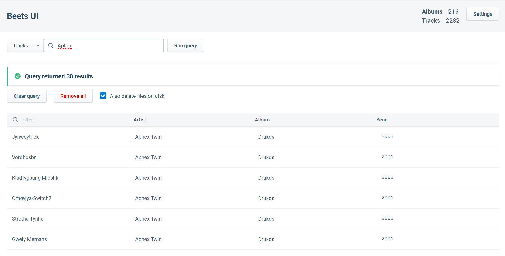

# Beets UI

A web interface for managing a [Beets](https://beets.io/) music library.



Features:
* Query albums and tracks in your library using Beets query syntax
* View album and track metadata
* Delete music from your library
* Completely client-side and self-hostable
* Supports basic authentication and HTTPS for communicating with Beets securely

## For users

Beets UI is a simple client-side webapp. When you first use it, you will be asked to provide the URL of a running instance of the Beets web API, which you need to host yourself.

You can access this webapp at [beets-ui.cadel.me](http://beets-ui.cadel.me/).

### Tips for hosting the API

To enable the Beets web API on the default port, use this Beets config:

```yaml
---
plugins: web
web:
  cors: '*'
  reverse_proxy: true
```

#### Nginx reverse proxy

If you want to host the web API via a reverse proxy with authentication, I would recommend using Nginx.

The sample server config below uses basic authentication and LetsEncrypt for HTTPS - you will need to adapt it for your
use case.

```
upstream beets {
    server 127.0.0.1:8337;
    keepalive 64;
}

server {
    listen 443 ssl;

    server_name beets.domain.com;

    location / {
        auth_basic           "Log in to Beets UI";
        auth_basic_user_file /etc/nginx/.htpasswd;

        client_max_body_size 100M;

        # From https://enable-cors.org/server_nginx.html
        if ($request_method = 'OPTIONS') {
           add_header 'Access-Control-Allow-Origin' '*';
           add_header 'Access-Control-Allow-Methods' 'GET, POST, OPTIONS, PATCH, DELETE';
           add_header 'Access-Control-Allow-Headers' 'DNT,User-Agent,X-Requested-With,If-Modified-Since,Cache-Control,Content-Type,Range,Authorization';
           add_header 'Access-Control-Max-Age' 1728000;
           add_header 'Content-Type' 'text/plain; charset=utf-8';
           add_header 'Content-Length' 0;
           return 204;
        }

        proxy_set_header X-Forwarded-Host $host;
        proxy_set_header X-Forwarded-Server $host;
        proxy_set_header X-Forwarded-For $proxy_add_x_forwarded_for;
        proxy_pass http://beets;
        proxy_http_version 1.1;
        proxy_pass_request_headers on;
        proxy_set_header Connection "keep-alive";
        proxy_store off;
    }

    ssl_certificate /etc/letsencrypt/live/beets.domain.com/fullchain.pem;
    ssl_certificate_key /etc/letsencrypt/live/beets.domain.com/privkey.pem;

    ssl_session_timeout 1d;
    ssl_session_cache shared:SSL:50m;
    ssl_session_tickets off;

    ssl_dhparam /etc/ssl/certs/dhparam.pem;

    ssl_protocols TLSv1.2 TLSv1.3;
    ssl_ciphers ECDHE-ECDSA-AES128-GCM-SHA256:ECDHE-RSA-AES128-GCM-SHA256:ECDHE-ECDSA-AES256-GCM-SHA384:ECDHE-RSA-AES256-GCM-SHA384:ECDHE-ECDSA-CHACHA20-POLY1305:ECDHE-RSA-CHACHA20-POLY1305:DHE-RSA-AES128-GCM-SHA256:DHE-RSA-AES256-GCM-SHA384;
    ssl_prefer_server_ciphers off;
}
```

## For self-hosters

To self host the webapp, follow the build instructions in the "For developers section" and then read the
[Deployment guide](https://create-react-app.dev/docs/deployment) from the `create-react-app` docs.

All you really need to do is statically serve the files generated into the `build` folder.

## For developers

In the project directory, you can run:

### `yarn start`

Runs the app in the development mode.<br />
Open [http://localhost:3000](http://localhost:3000) to view it in the browser.

The page will reload if you make edits.<br />
You will also see any lint errors in the console.

### `yarn build`

Builds the app for production to the `build` folder.<br />
It correctly bundles React in production mode and optimizes the build for the best performance.

The build is minified and the filenames include the hashes.<br />
Your app is ready to be deployed!
